# qa_guru_at_final_project
# Автотесты на https://m2.ru/


IntelliJ IDEA, Java, Selenide, Selenoid, Gradle, JUnit5, Allure Report, Allure TestOps, Github, Jenkins, Rest-Assured,
Telegram (notifications), Jira.

# Реализованы проверки:
В реализации использованы разные подходы проектирования, позволяющие достичь разного представления в отчетах
### UI
- Авторизация пользователя с верными данными
- Авторизация пользователя с неверным паролем
- Поиск квартриры по заданным параметрам
- Использование сервиса оценки квартиры
- Отображение разделов на главное странице

### API
- Проверка на получениие имени 
- Проверка нполучение информации общего колличества
- Проверка на получение информации о массе
- Проверка на получение информации о росте

### Команда для запуска из терминала
Локально должны быть заданы параметры в local.properies, app.properties
```
gradle clean
```
Для запуска в несколько потоков
```
gradle clean -Dthreads=3
```
### Видео о прохождении тестов


### Запуск в Jenkins
Статистика по запускам
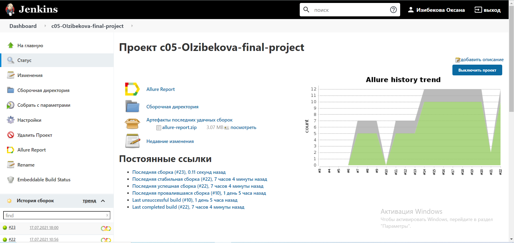

### Отчёт в Allure Report
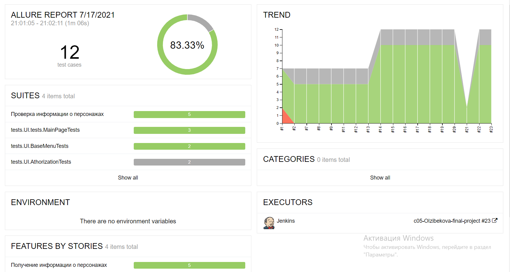

### Хранение тест-кейсов в Allure TestOps
Ручные и автотесты
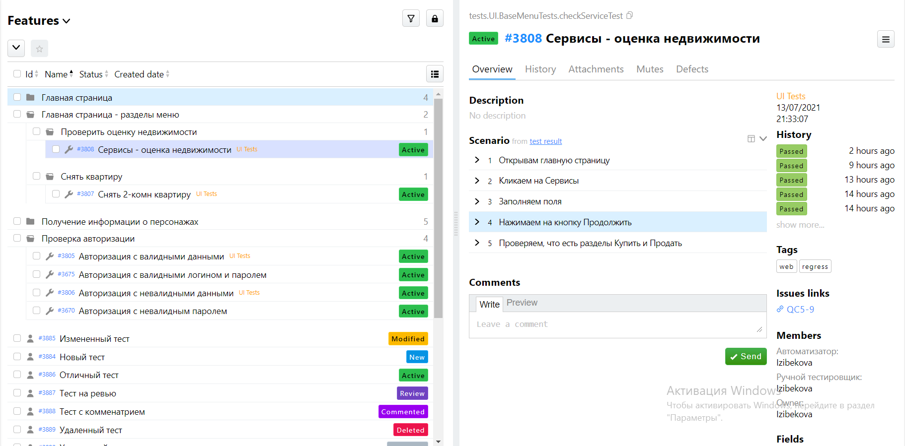
Ручной тест
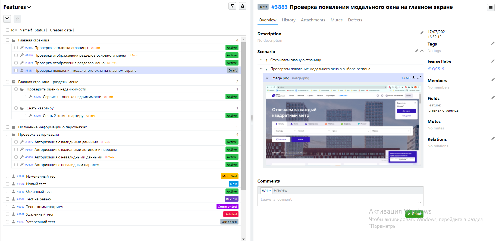
Автоматизированный тест
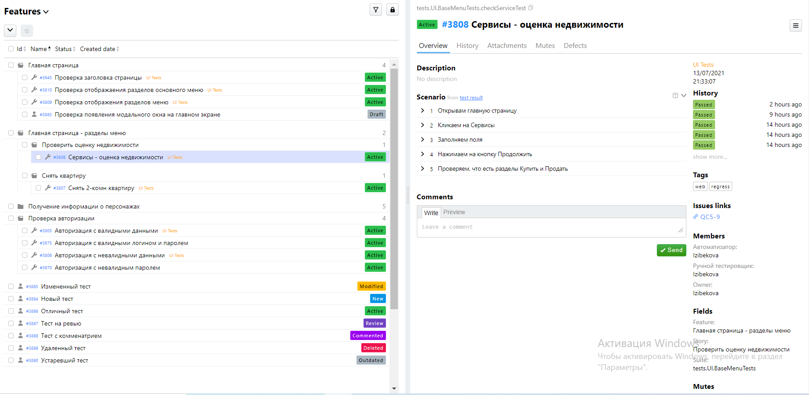
Основной дашборд для отслеживания
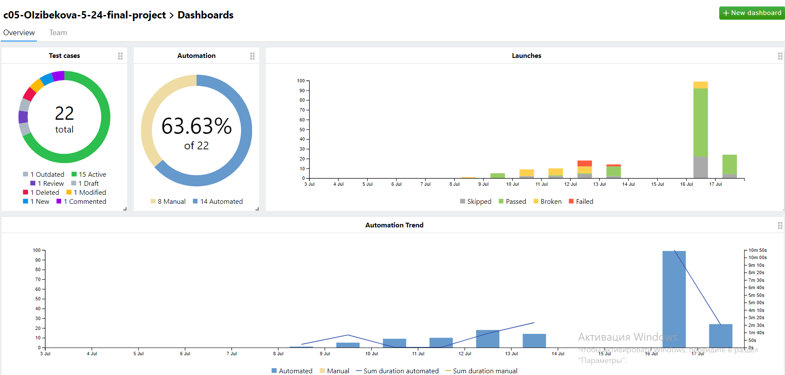
Дашборд по разным типам тестов
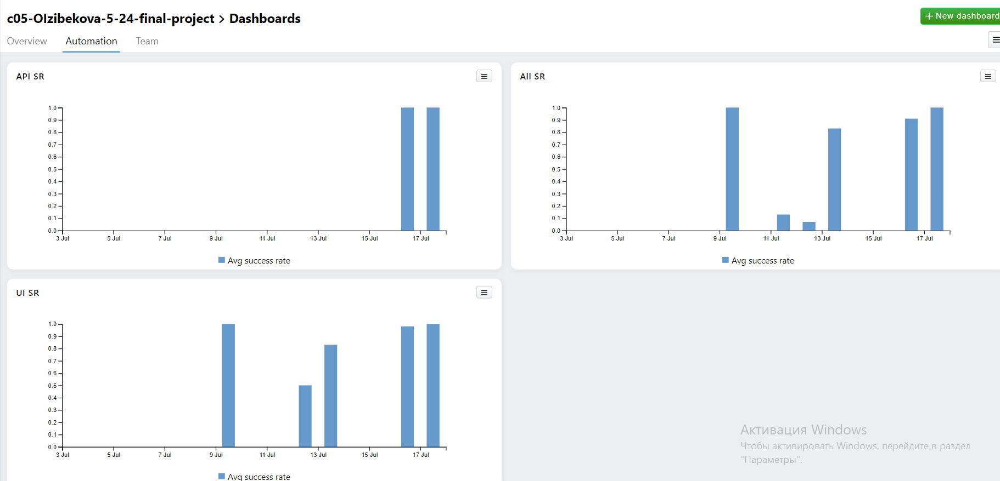
Дашборд по команде
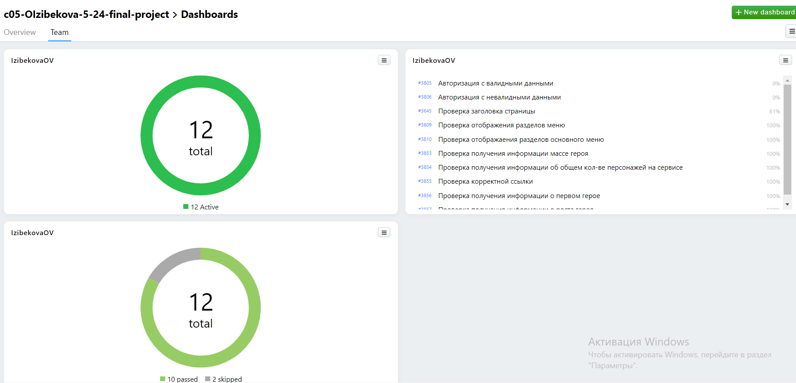
Результат запуска ланча
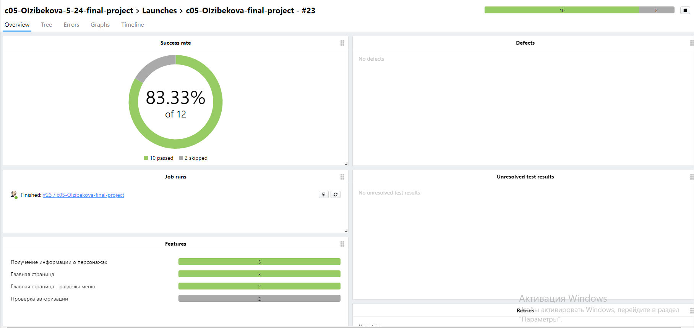

### В качестве багтрекера использовалась Jira, у которой была настроена интеграция с Allure TestOps
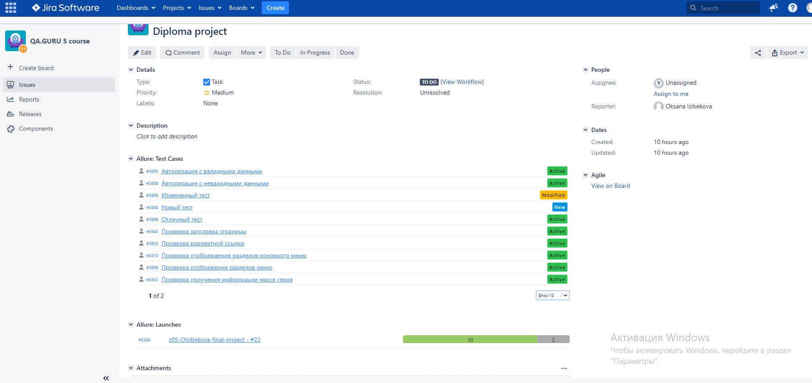

### Уведомления в Telegram
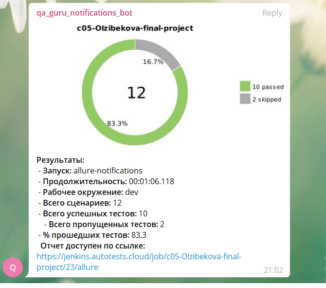
